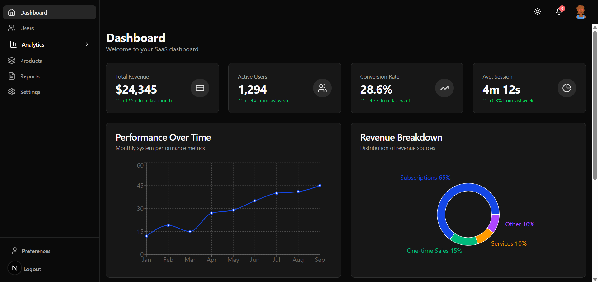
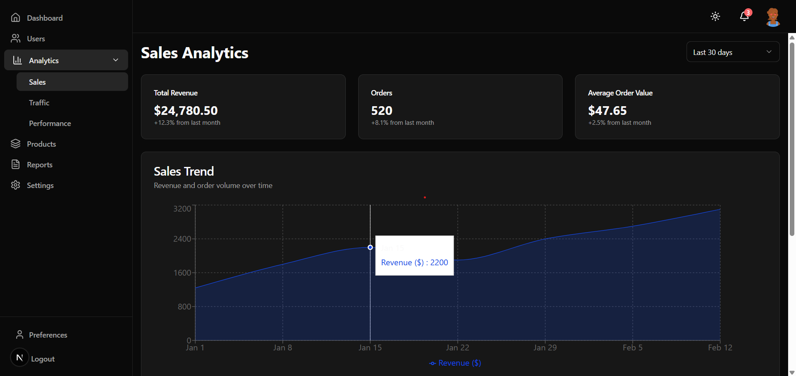
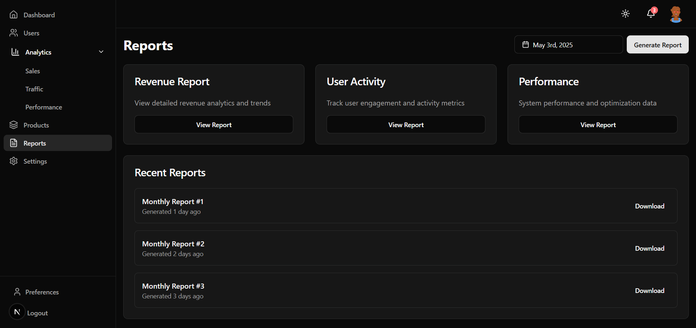
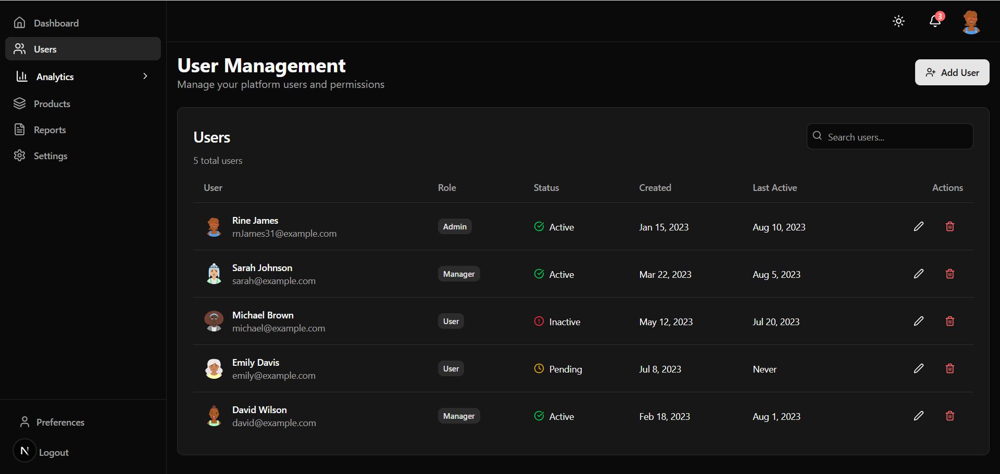
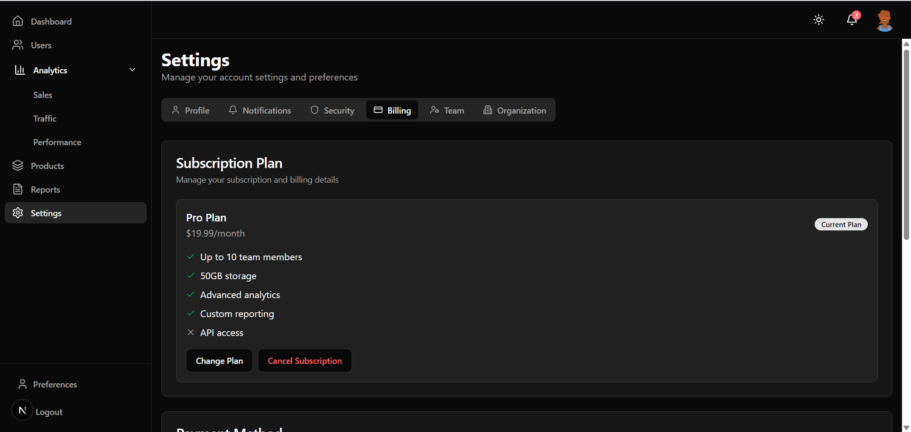
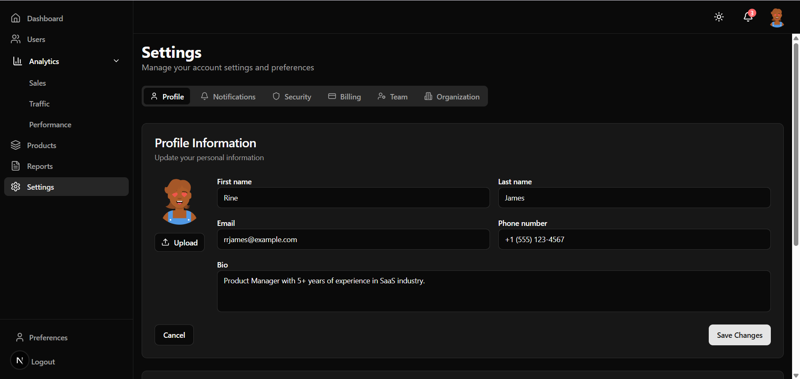
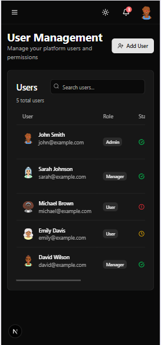
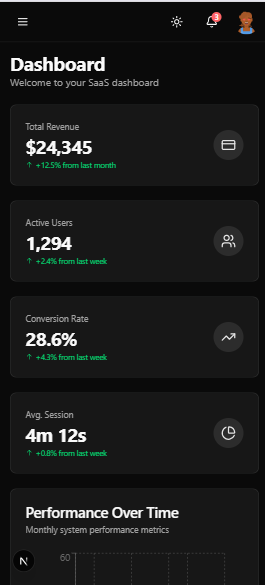
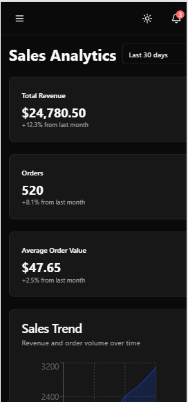

# SaaS Dashboard Pro

A comprehensive, enterprise-grade dashboard solution built with Next.js 13+, featuring advanced analytics, user management with CRUD operations, and powerful reporting tools. This scalable platform enables SaaS businesses to monitor KPIs, manage products, and control system settings through an intuitive interface built with TypeScript, Tailwind CSS, and Zustand state management.

## Screenshots

### Dashboard Overview

*Comprehensive analytics dashboard with revenue metrics, user growth, and interactive data visualizations using Recharts.*

### Analytics

*Detailed analytics interface with trend visualization, user behavior patterns, and conversion metrics.*

### Product Management

*Complete product administration with inventory tracking, performance metrics, and category management.*

### Reports

*Customizable reporting tools for generating insights with exportable data in multiple formats.*

### User Management

*Complete user administration interface with CRUD operations, filtering, role management, and bulk actions.*

### Settings Panel


*Customizable application settings with profile management, notification preferences, and security controls.*

### Mobile Responsiveness
<div style="display: flex; justify-content: space-between; gap: 10px;">
  
  
  
</div>

*Fully responsive design that adapts seamlessly to mobile devices with optimized navigation.*

## Tech Stack

<div align="center">
  
  
  
  
  
  
</div>

### Frontend
- **Next.js**: App Router for optimized rendering and routing
- **React**: Component-based UI development
- **TypeScript**: Type-safe code with improved developer experience
- **Tailwind CSS**: Utility-first CSS framework for responsive design
- **Shadcn UI**: High-quality UI components built with Radix UI and Tailwind
- **Recharts**: Composable charting library for data visualization
- **Lucide Icons**: Beautiful, consistent icon set

### State Management
- **Zustand**: Lightweight state management with hooks
- **React Context API**: For global state management
- **Custom Hooks**: For reusable logic and state encapsulation

## Application Features

### Analytics & Reporting
- **Interactive Charts**: Visualize key metrics with pie charts, line graphs, and bar charts
- **Revenue Tracking**: Monitor financial performance with detailed breakdowns
- **User Analytics**: Track user growth, engagement, and behavior patterns
- **Customizable Dashboards**: Drag-and-drop interface to personalize metric displays
- **Real-time Data**: Live updates for immediate decision making
- **Custom Report Builder**: Generate tailored reports with specific metrics
- **Data Export**: Download reports in multiple formats (PDF, Excel, CSV)
- **Scheduled Reports**: Automate report generation and distribution

### Product Management
- **Inventory Tracking**: Monitor product levels and stock status
- **Performance Metrics**: Track product popularity and sales performance
- **Category Management**: Organize products with customizable categories
- **Pricing Controls**: Manage product pricing and discount settings
- **Media Management**: Handle product images and documentation

### User Management
- **Role-Based Access**: Granular permission controls for different user types
- **Bulk Actions**: Efficiently manage multiple users simultaneously
- **Search & Filter**: Quickly find users based on various parameters
- **User Profiles**: Comprehensive user information management

### Application Settings
- **Theme Customization**: Toggle between light and dark modes
- **Notification Preferences**: Control email and in-app notifications
- **Security Settings**: Two-factor authentication and password policies
- **Account Management**: Subscription and billing information

### Technical Implementation
- Built with Next.js App Router for optimized performance
- Shadcn UI components for a consistent design system
- Responsive design using Tailwind CSS
- Interactive data visualization with Recharts
- Toast notifications for user feedback
- Server-side rendering for improved SEO and load times

## Getting Started

First, run the development server:

```bash
npm run dev
# or
yarn dev
# or
pnpm dev
# or
bun dev
```

Open [http://localhost:3000](http://localhost:3000) with your browser to see the result.

You can start editing the page by modifying `app/page.tsx`. The page auto-updates as you edit the file.

This project uses [`next/font`](https://nextjs.org/docs/app/building-your-application/optimizing/fonts) to automatically optimize and load [Geist](https://vercel.com/font), a new font family for Vercel.

## Learn More

To learn more about Next.js, take a look at the following resources:
- [Next.js Documentation](https://nextjs.org/docs) - learn about Next.js features and API.
- [Learn Next.js](https://nextjs.org/learn) - an interactive Next.js tutorial.

You can check out [the Next.js GitHub repository](https://github.com/vercel/next.js/) - your feedback and contributions are welcome!

## Deploy on Vercel

The easiest way to deploy your Next.js app is to use the [Vercel Platform](https://vercel.com) from the creators of Next.js.

Check out our [Next.js deployment documentation](https://nextjs.org/docs/deployment) for more details.

## Contact Me

Have questions about this dashboard application or interested in custom implementations?

## Contact

Feel free to reach out with feedback or inquiries:

**Email**: [e.bryandze@gmail.com]
**X** : [https://x.com/dze_bryan]
**LinkedIn**: [www.linkedin.com/in/dzebryan237]
**GitHub**: [https://github.com/G-Bryan237]

### Professional Services
- Custom dashboard development
- Next.js application consulting
- UI/UX optimization for web applications
- Data visualization implementation

Feel free to reach out for collaborations, questions about the codebase, or potential opportunities!
