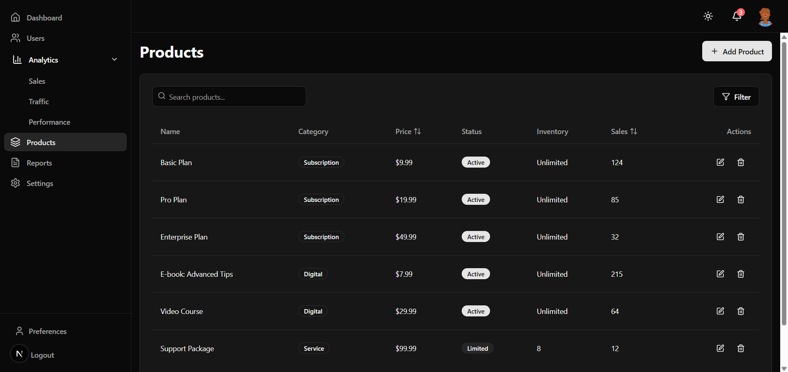

# SaaS Dashboard Pro

A comprehensive, enterprise-grade dashboard solution built with Next.js 13+, featuring advanced analytics, user management with CRUD operations, and powerful reporting tools. This scalable platform enables SaaS businesses to monitor KPIs, manage products, and control system settings through an intuitive interface built with TypeScript, Tailwind CSS, and Zustand state management.

## Screenshots

### Dashboard Overview

*Comprehensive analytics dashboard with revenue metrics, user growth, and interactive data visualizations using Recharts.*

### Analytics

*Detailed analytics interface with trend visualization, user behavior patterns, and conversion metrics.*

### Product Management

*Complete product administration with inventory tracking, performance metrics, and category management.*

### Reports

*Customizable reporting tools for generating insights with exportable data in multiple formats.*

### User Management

*Complete user administration interface with CRUD operations, filtering, role management, and bulk actions.*

### Settings Panel


*Customizable application settings with profile management, notification preferences, and security controls.*

### Mobile Responsiveness
<div style="display: flex; justify-content: space-between; gap: 10px;">
  
  
  
</div>

*Fully responsive design that adapts seamlessly to mobile devices with optimized navigation.*

## Tech Stack

<div align="center">
  
  
  
  
  
  
</div>

### Frontend
- **Next.js**: App Router for optimized rendering and routing
- **React**: Component-based UI development
- **TypeScript**: Type-safe code with improved developer experience
- **Tailwind CSS**: Utility-first CSS framework for responsive design
- **Shadcn UI**: High-quality UI components built with Radix UI and Tailwind
- **Recharts**: Composable charting library for data visualization
- **Lucide Icons**: Beautiful, consistent icon set

### State Management
- **Zustand**: Lightweight state management with hooks
- **React Context API**: For global state management
- **Custom Hooks**: For reusable logic and state encapsulation- **Zustand**: For simplified and scalable state management

### Development Tools
- **ESLint**: JavaScript and TypeScript lintingpeScript lintingin performance optimization- **Next.js Dev Tools**: Built-in performance optimization
- **Prettier**: Code formatting
- **Next.js Dev Tools**: Built-in performance optimization- **Next.js Dev Tools**: Built-in performance optimization## Application Features## Application Features

## Application Features## Application Features### Analytics & Reporting
 Visualize key metrics with pie charts, line graphs, and bar chartsand bar charts
### Analytics & Reporting
- **Interactive Charts**: Visualize key metrics with pie charts, line graphs, and bar chartsand bar charts
- **Revenue Tracking**: Monitor financial performance with detailed breakdownsownsic displaysalize metric displays
- **User Analytics**: Track user growth, engagement, and behavior patterns
- **Customizable Dashboards**: Drag-and-drop interface to personalize metric displaysalize metric displaysific metricsics
- **Real-time Data**: Live updates for immediate decision making
- **Custom Report Builder**: Generate tailored reports with specific metricsicsled Reports**: Automate report generation and distribution
- **Data Export**: Download reports in multiple formats (PDF, Excel, CSV) CSV)
- **Scheduled Reports**: Automate report generation and distribution- **Scheduled Reports**: Automate report generation and distribution### Product Management
**: Monitor product levels and stock status
### Product Managementformance
- **Inventory Tracking**: Monitor product levels and stock statusories
- **Performance Metrics**: Track product popularity and sales performance
- **Category Management**: Organize products with customizable categoriesoriesManagement**: Handle product images and documentation
- **Pricing Controls**: Manage product pricing and discount settingstings
- **Media Management**: Handle product images and documentation- **Media Management**: Handle product images and documentation### User Management
ss**: Granular permission controls for different user typesuser types
### User Management
- **Role-Based Access**: Granular permission controls for different user typesuser typessameters
- **Bulk Actions**: Efficiently manage multiple users simultaneouslyles**: Comprehensive user information management
- **Search & Filter**: Quickly find users based on various parametersameters
- **User Profiles**: Comprehensive user information management- **User Profiles**: Comprehensive user information management### Application Settings
*: Toggle between light and dark modes
### Application Settingsications
- **Theme Customization**: Toggle between light and dark modesesd policies
- **Notification Preferences**: Control email and in-app notificationsnt**: Subscription and billing information
- **Security Settings**: Two-factor authentication and password policiesd policies
- **Account Management**: Subscription and billing information- **Account Management**: Subscription and billing information### Technical Implementation
ter for optimized performanceance
### Technical Implementation system
- Built with Next.js App Router for optimized performanceance
- Shadcn UI components for a consistent design systemt design systemRechartsecharts
- Responsive design using Tailwind CSS
- Interactive data visualization with RechartsechartsO and load times- Server-side rendering for improved SEO and load times
- Toast notifications for user feedback
- Server-side rendering for improved SEO and load times- Server-side rendering for improved SEO and load times## Getting Started## Getting Started

## Getting Started## Getting StartedFirst, run the development server:First, run the development server:

First, run the development server:First, run the development server:```bash
 devrun dev
```bash
npm run devrun dev dev dev
# or
yarn dev dev dev dev
# or
pnpm dev devdev dev
# or
bun dev dev
``````Open [http://localhost:3000](http://localhost:3000) with your browser to see the result.Open [http://localhost:3000](http://localhost:3000) with your browser to see the result.

Open [http://localhost:3000](http://localhost:3000) with your browser to see the result.Open [http://localhost:3000](http://localhost:3000) with your browser to see the result.You can start editing the page by modifying `app/page.tsx`. The page auto-updates as you edit the file.You can start editing the page by modifying `app/page.tsx`. The page auto-updates as you edit the file.

You can start editing the page by modifying `app/page.tsx`. The page auto-updates as you edit the file.You can start editing the page by modifying `app/page.tsx`. The page auto-updates as you edit the file.This project uses [`next/font`](https://nextjs.org/docs/app/building-your-application/optimizing/fonts) to automatically optimize and load [Geist](https://vercel.com/font), a new font family for Vercel.This project uses [`next/font`](https://nextjs.org/docs/app/building-your-application/optimizing/fonts) to automatically optimize and load [Geist](https://vercel.com/font), a new font family for Vercel.

This project uses [`next/font`](https://nextjs.org/docs/app/building-your-application/optimizing/fonts) to automatically optimize and load [Geist](https://vercel.com/font), a new font family for Vercel.This project uses [`next/font`](https://nextjs.org/docs/app/building-your-application/optimizing/fonts) to automatically optimize and load [Geist](https://vercel.com/font), a new font family for Vercel.## Learn More## Learn More

## Learn More## Learn MoreTo learn more about Next.js, take a look at the following resources:To learn more about Next.js, take a look at the following resources:

To learn more about Next.js, take a look at the following resources:To learn more about Next.js, take a look at the following resources:- [Next.js Documentation](https://nextjs.org/docs) - learn about Next.js features and API.res and API.
//nextjs.org/learn) - an interactive Next.js tutorial.
- [Next.js Documentation](https://nextjs.org/docs) - learn about Next.js features and API.res and API.
- [Learn Next.js](https://nextjs.org/learn) - an interactive Next.js tutorial.- [Learn Next.js](https://nextjs.org/learn) - an interactive Next.js tutorial.You can check out [the Next.js GitHub repository](https://github.com/vercel/next.js/) - your feedback and contributions are welcome!You can check out [the Next.js GitHub repository](https://github.com/vercel/next.js/) - your feedback and contributions are welcome!

You can check out [the Next.js GitHub repository](https://github.com/vercel/next.js/) - your feedback and contributions are welcome!You can check out [the Next.js GitHub repository](https://github.com/vercel/next.js/) - your feedback and contributions are welcome!## Deploy on Vercel## Deploy on Vercel

## Deploy on Vercel## Deploy on VercelThe easiest way to deploy your Next.js app is to use the [Vercel Platform](https://vercel.com) from the creators of Next.js.The easiest way to deploy your Next.js app is to use the [Vercel Platform](https://vercel.com) from the creators of Next.js.

The easiest way to deploy your Next.js app is to use the [Vercel Platform](https://vercel.com) from the creators of Next.js.The easiest way to deploy your Next.js app is to use the [Vercel Platform](https://vercel.com) from the creators of Next.js.Check out our [Next.js deployment documentation](https://nextjs.org/docs/deployment) for more details.Check out our [Next.js deployment documentation](https://nextjs.org/docs/deployment) for more details.

Check out our [Next.js deployment documentation](https://nextjs.org/docs/deployment) for more details.Check out our [Next.js deployment documentation](https://nextjs.org/docs/deployment) for more details.## Contact Me## Contact Me

## Contact Me## Contact MeHave questions about this dashboard application or interested in custom implementations?Have questions about this dashboard application or interested in custom implementations?

Have questions about this dashboard application or interested in custom implementations?Have questions about this dashboard application or interested in custom implementations?
## Contact

## ContactFeel free to reach out with feedback or inquiries:

Feel free to reach out with feedback or inquiries: **Email**: [e.bryandze@gmail.com]

 **Email**: [e.bryandze@gmail.com]n/dzebryan237]
 **X** : [https://x.com/dze_bryan]
 **LinkedIn**: [www.linkedin.com/in/dzebryan237]
 **GitHub**: [https://github.com/G-Bryan237]
### Professional Services
pment
### Professional Servicesng
- Custom dashboard developmentlications
- Next.js application consulting
- UI/UX optimization for web applications
- Data visualization implementationFeel free to reach out for collaborations, questions about the codebase, or potential opportunities!

Feel free to reach out for collaborations, questions about the codebase, or potential opportunities!
